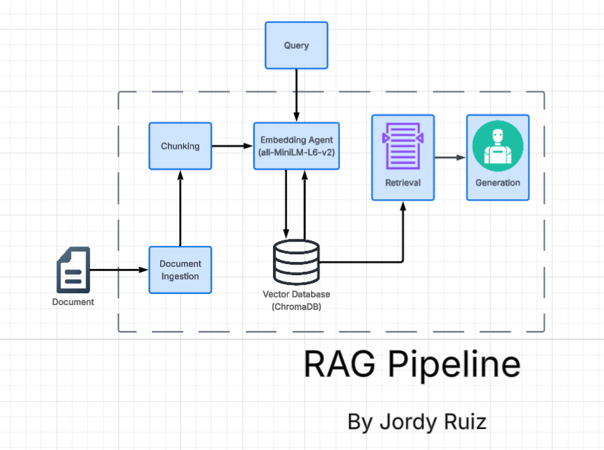

# Project 1 Planning: The Unofficial Guide

> Write this document before you write any pipeline code.
> Your spec and architecture diagram are what you'll use to direct AI tools (Claude, Copilot, etc.) to generate your implementation — the more specific they are, the more useful the generated code will be.
> Update the Retrieval Approach and Chunking Strategy sections if you change your approach during implementation.
> Update this file before starting any stretch features.

---

## Domain

<!-- What domain did you choose? Why is this knowledge valuable and hard to find through official channels? -->
The domain will focus on Terraria, a 2D adventure game with hundreds
of items, multiples classes,  and a nonlinear boss progression. This
is valuable because Terraria has a steep learning curb with a basic
tutorial. While the official Terraria wiki catalogs everything, it
requires prior knowledge and the context of already knowing what to
search up. All information is scattered throughout the internet: wiki,
Reddit, 3rd party forums, etc.
---

## Documents

<!-- List your specific sources: URLs, subreddit names, forum threads, or file descriptions.
     Aim for at least 10 sources that together cover different subtopics or perspectives within your domain. -->

| # | Source | Description | URL or location |
|---|--------|-------------|-----------------|
| 1 | Terraria Wiki | Overview of all bosses, spawn conditions, and loot | https://terraria.wiki.gg/wiki/Bosses |
| 2 | Terraria Wiki | Getting started guide for new players | https://terraria.wiki.gg/wiki/Guide:Getting_started |
| 3 | Terraria Wiki | Overview of Hardmode mechanics, new enemies, and progression after Wall of Flesh | https://terraria.wiki.gg/wiki/Hardmode |
| 4 | Terraria Wiki | Recommended weapons, armor, and accessories by class and game stage | https://terraria.wiki.gg/wiki/Guide:Class_setups |
| 5 | Terraria Wiki | Overview of all biomes, their characteristics, and locations | https://terraria.wiki.gg/wiki/Biomes |
| 6 | Terraria Wiki | All in-game events, their triggers, and unique enemy/item drops | https://terraria.wiki.gg/wiki/Events |
| 7 | Terraria Wiki | Movement accessories: boots, wings, mounts, and mobility items | https://terraria.wiki.gg/wiki/Movement_Accessories |
| 8 | Terraria Wiki | Combat accessories: damage, crit, and defense boosting items | https://terraria.wiki.gg/wiki/Combat_Accessories |
| 9 | Terraria Wiki | NPC spawn conditions, housing requirements, and vendor inventories | https://terraria.wiki.gg/wiki/NPCs |
| 10 | Steam Community | Curated list of special world seeds with rare glitches and optimized starting conditions | https://steamcommunity.com/sharedfiles/filedetails/?id=1283674938 |

---

## Chunking Strategy

<!-- How will you split documents into chunks?
     State your chunk size (in tokens or characters), overlap size, and explain why those
     numbers fit the structure of your documents.
     A review-heavy corpus warrants different chunking than a long FAQ. -->

**Chunk size:** 
500 characters

**Overlap:** 
50 characters

**Reasoning:** 
Terraria wiki pages are structured reference content where useful information spans multiple sentences — a boss entry includes its name, spawn condition, and drops in close proximity, and splitting those apart would hurt retrieval. 500 characters keeps enough context together for the embedding to capture meaning without diluting it across too wide a window. Paragraph-based chunking was ruled out because wiki paragraphs vary wildly in length. 50-character overlap prevents key facts from being lost at chunk boundaries, which matters for pages like Guide:Class_setups where item names and their context sit near section edges.

---

## Retrieval Approach

<!-- Which embedding model are you using (e.g., all-MiniLM-L6-v2 via sentence-transformers)?
     How many chunks will you retrieve per query (top-k)?
     If you were deploying this for real users and cost wasn't a constraint, what tradeoffs
     would you weigh in choosing a different embedding model — context length, multilingual
     support, accuracy on domain-specific text, latency? -->

**Embedding model:** 
all-MiniLM-L6-v2 (via sentence-transformers)

**Top-k:** 
5

**Production tradeoff reflection:** 
all-MiniLM-L6-v2 is fast and runs locally with no cost, but has a 256-token context limit — long wiki sections get truncated before embedding, which can weaken retrieval for dense pages. For a real deployment I'd weigh switching to OpenAI's text-embedding-3-small: better accuracy on domain-specific terminology (item names, biome names) and a much larger context window, at the cost of API latency and per-token pricing. Multilingual support isn't a concern here since all sources are English. For latency-sensitive production use, a locally hosted model like bge-large-en would be a middle ground — stronger than MiniLM without the network round-trip of an API call.

---

## Evaluation Plan

<!-- List your 5 test questions with their expected correct answers.
     Questions should be specific enough that you can judge whether the system's response
     is right or wrong. "What are good dining halls?" is too vague.
     "What do students say about wait times at [dining hall name] during lunch?" is testable. -->

| # | Question | Expected answer |
|---|----------|-----------------|
| 1 | What item is used to manually summon the Eye of Cthulhu? | A Suspicious Looking Eye, crafted at a Demon or Crimson Altar using 6 Lens |
| 2 | What armor should a summoner player use in early Hardmode? | Spider Armor, crafted from Spider Fangs dropped by Black Recluses in Spider Caves |
| 3 | What biome do you need to find Chlorophyte Ore, and what can mine it? | The Underground Jungle; requires a Pickaxe Axe or Drax, both crafted after defeating a Mechanical Boss |
| 4 | What triggers a Blood Moon and what enemies does it spawn? | Occurs randomly at night (or by using a Bloody Tear); spawns Zombies, Demon Eyes, and Clowns |
| 5 | What accessories improve movement speed in early game? | Hermes Boots (found in underground chests), Sailfish Boots (fishing reward), or Flurry Boots — all combinable into Lightning Boots later |

---

## Anticipated Challenges

<!-- What could go wrong? Name at least two specific risks with reasoning.
     Consider: noisy or inconsistent documents, missing source attribution, off-topic
     retrieval, chunks that split key information across boundaries. -->

1. **Outdated or version-specific information.** Terraria has received major updates (e.g., Journey's End) that changed item stats, crafting recipes, and boss behavior. Wiki pages may mix pre- and post-update content without clear labeling, so the RAG system could return accurate-sounding but outdated answers. This is hard to detect automatically — the embedding model has no concept of game versions.

2. **Chunks that split progression-gated context.** A chunk might name an item or accessory without including the surrounding sentence that says it's only available post-Hardmode or after a specific boss. If that context lands in the adjacent chunk, retrieval may return the item name without the prerequisite — leading the model to give incomplete or misleading advice. The 50-character overlap reduces this risk but doesn't eliminate it.

---

## Architecture

<!-- Draw a diagram of your pipeline showing the five stages:
     Document Ingestion → Chunking → Embedding + Vector Store → Retrieval → Generation
     Label each stage with the tool or library you're using.
     You can use ASCII art, a Mermaid diagram, or embed a sketch as an image.
     You'll use this diagram as context when prompting AI tools to implement each stage. -->

---

## AI Tool Plan

<!-- For each part of the pipeline below, describe:
     - Which AI tool you plan to use (Claude, Copilot, ChatGPT, etc.)
     - What you'll give it as input (which sections of this planning.md, which requirements)
     - What you expect it to produce
     - How you'll verify the output matches your spec

     "I'll use AI to help me code" is not a plan.
     "I'll give Claude my Chunking Strategy section and ask it to implement chunk_text()
     with my specified chunk size and overlap" is a plan. -->

**Milestone 3 — Ingestion and chunking:**
- *Tool:* Claude Code
- *Input:* The Documents table (10 URLs) and the Chunking Strategy section (500-char chunks, 50-char overlap)
- *Expected output:* A Python script that fetches each URL with `requests` + `BeautifulSoup`, strips HTML tags and navigation boilerplate, and splits the plain text into chunks with the specified size and overlap
- *Verification:* Run the script and inspect chunk count and a sample of chunks manually — confirm no HTML tags leak through and that chunks are close to 500 characters

**Milestone 4 — Embedding and retrieval:**
- *Tool:* Claude Code
- *Input:* The Retrieval Approach section (all-MiniLM-L6-v2, top-k=5) and the chunk output from Milestone 3
- *Expected output:* Code to embed all chunks using `sentence-transformers`, store them in ChromaDB, and a `query(question)` function that returns the top-5 most relevant chunks
- *Verification:* Run one of the Evaluation Plan questions through `query()` and confirm the returned chunks come from the expected source page (e.g., the Blood Moon question should return chunks from the Events page)

**Milestone 5 — Generation and interface:**
- *Tool:* Claude Code
- *Input:* The 5 evaluation questions, the `query()` function from Milestone 4, and the grounding requirement (model must answer only from retrieved chunks)
- *Expected output:* A generation function that builds a prompt with the retrieved chunks as context, passes it to the Groq API, and returns a grounded response with source attribution
- *Verification:* Run all 5 evaluation questions and compare responses against the expected answers in the Evaluation Plan; check that the model cites sources and does not answer beyond the retrieved context
